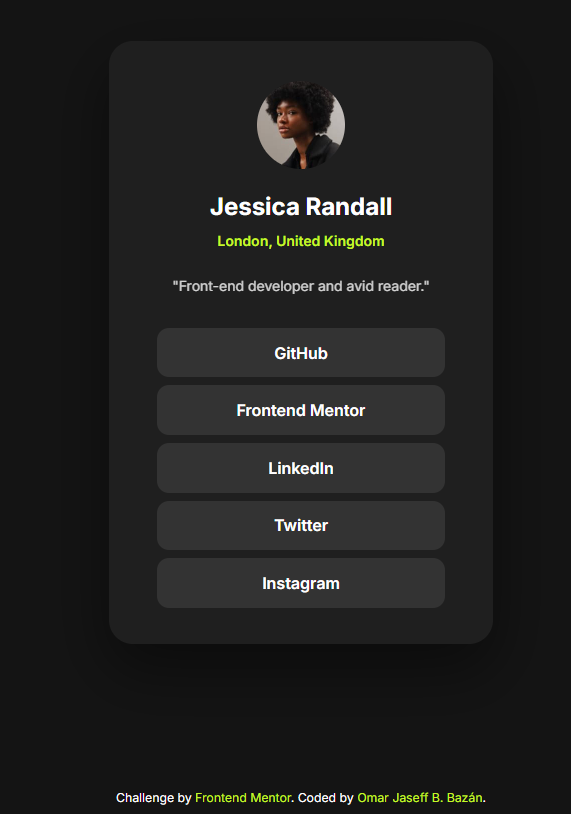

# Frontend Mentor - Social links profile solution

This is a solution to the [Social links profile challenge on Frontend Mentor](https://www.frontendmentor.io/challenges/social-links-profile-UG32l9m6dQ). Frontend Mentor challenges help you improve your coding skills by building realistic projects.

## Table of contents

- [Overview](#overview)
  - [The challenge](#the-challenge)
  - [Screenshot](#screenshot)
  - [Links](#links)
- [My process](#my-process)
  - [Built with](#built-with)
  - [What I learned](#what-i-learned)
  - [Continued development](#continued-development)
  - [Useful resources](#useful-resources)
- [Author](#author)

## Overview

### The challenge

Users should be able to:

- See hover and focus states for all interactive elements on the page

### Screenshot



### Links

- Solution URL: https://github.com/jaseff2805/FrontEndMentor_SocialLinksProfile_Jaseff2805
- Live Site URL: https://jaseff2805.github.io/FrontEndMentor_SocialLinksProfile_Jaseff2805/

## My process

### Built with

- Semantic HTML5 markup
- CSS custom properties
- Flexbox
- Mobile-first workflow
- [Bootstrap 5](https://getbootstrap.com/)
- [Inter](https://fonts.google.com/specimen/Inter) via Google Fonts
- Git & GitHub for version control

### What I learned

This project helped me practice building a centered card layout that still looks clean and balanced on both mobile and desktop. I also had to be careful when mixing Bootstrap utilities with custom CSS so the final result matched the design as closely as possible.

Some highlights:

- Loading a Google Font and using it as the main typeface:

```css
body {
  font-family: "Inter", system-ui, -apple-system, BlinkMacSystemFont,
    "Segoe UI", sans-serif;
}
```

- Creating reusable button styles for the social links on top of Bootstrap’s `.btn`:

```css
.btn-profile {
  background-color: hsl(0, 0%, 20%);
  color: hsl(0, 0%, 100%);
  border-radius: 0.75rem;
  border: none;
  font-weight: 600;
  padding: 0.8rem 1.2rem;
  transition:
    background-color 150ms ease,
    color 150ms ease,
    transform 150ms ease;
}

.btn-profile:hover,
.btn-profile:focus-visible {
  background-color: hsl(75, 94%, 57%);
  color: hsl(0, 0%, 8%);
  transform: translateY(-1px);
}
```

- Using typographic hierarchy to match the design (name, location, and bio):

```css
.profile-card__name {
  font-weight: 700;
}

.profile-card__location {
  font-weight: 600;
  color: hsl(75, 94%, 57%);
}

.profile-card__bio {
  opacity: 0.8;
}
```

### Continued development

In future projects I’d like to keep improving on:

- Getting even closer to “pixel-perfect” results when recreating Figma designs with Bootstrap and custom CSS.
- Structuring my CSS so overrides to frameworks stay minimal, clear, and easy to maintain.
- Adding more accessibility checks, like testing keyboard navigation and using tools to verify color contrast.

### Useful resources

- [MDN Web Docs](https://developer.mozilla.org/) – For HTML and CSS reference.
- [Bootstrap documentation](https://getbootstrap.com/docs/5.3/getting-started/introduction/) – To better understand Bootstrap’s utility classes and how to extend them.
- [Frontend Mentor](https://www.frontendmentor.io) – For the original challenge and design.

## Author

- Frontend Mentor - https://www.frontendmentor.io/profile/jaseff2805
- GitHub - https://github.com/jaseff2805
